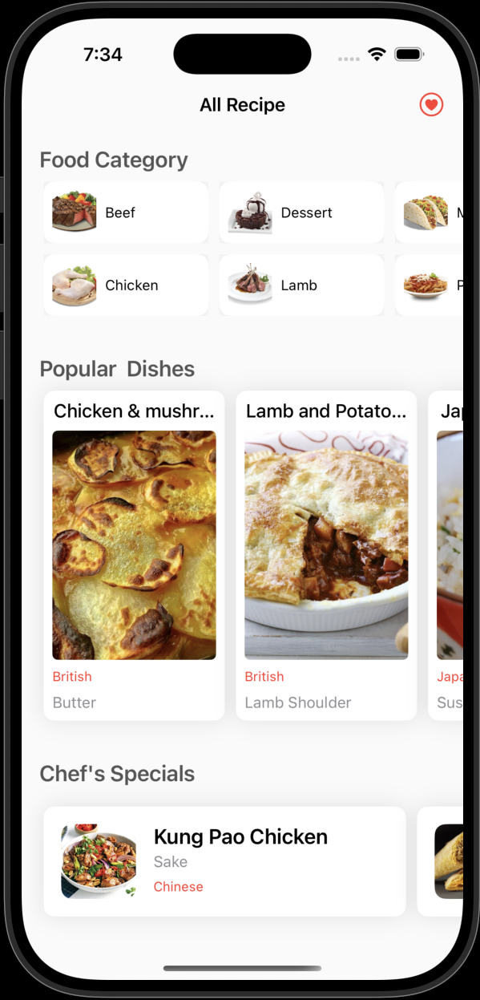
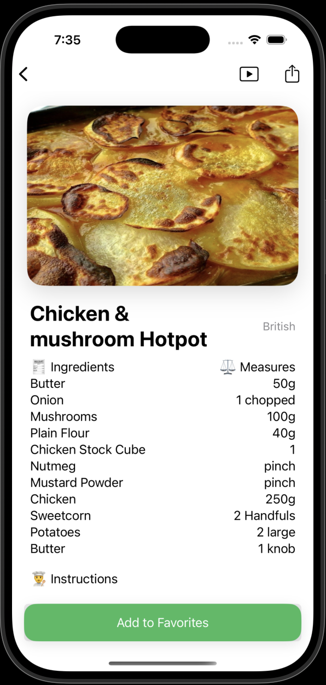
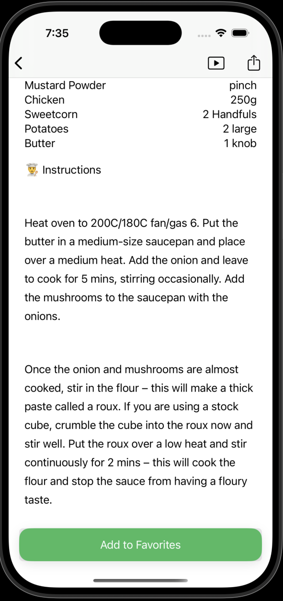
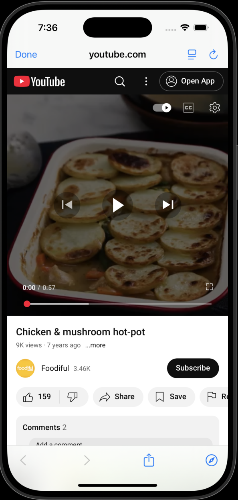
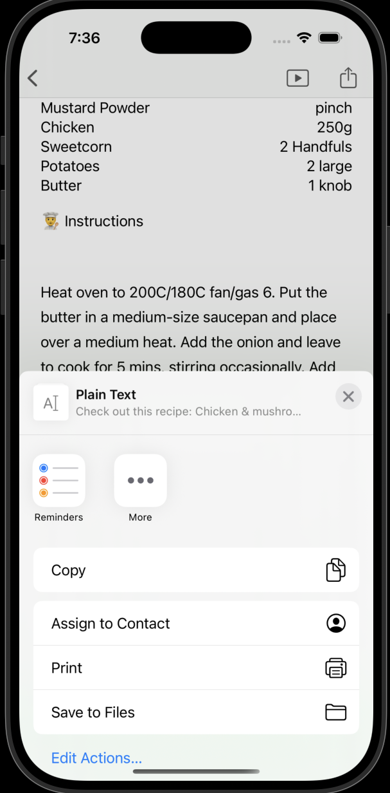
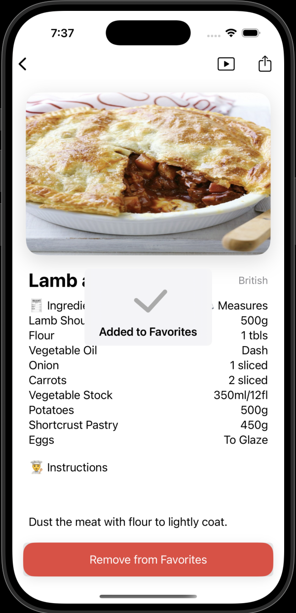
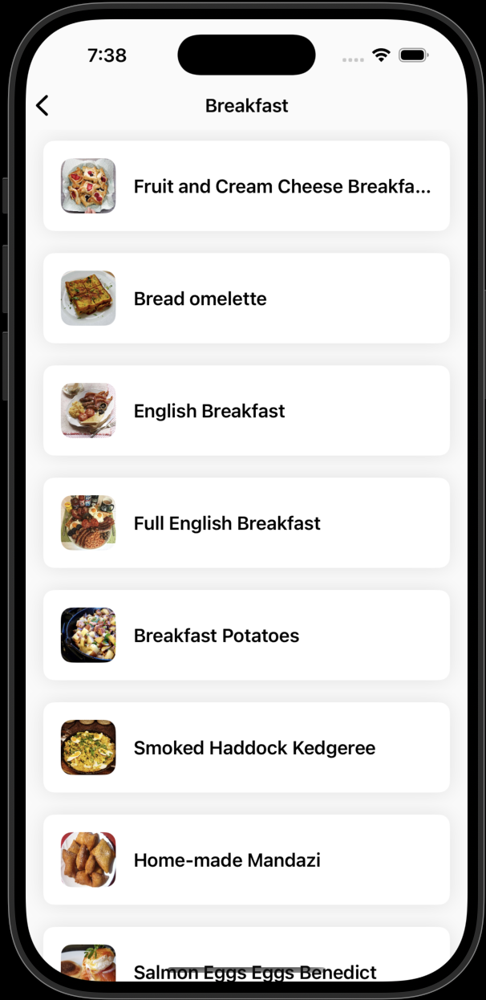
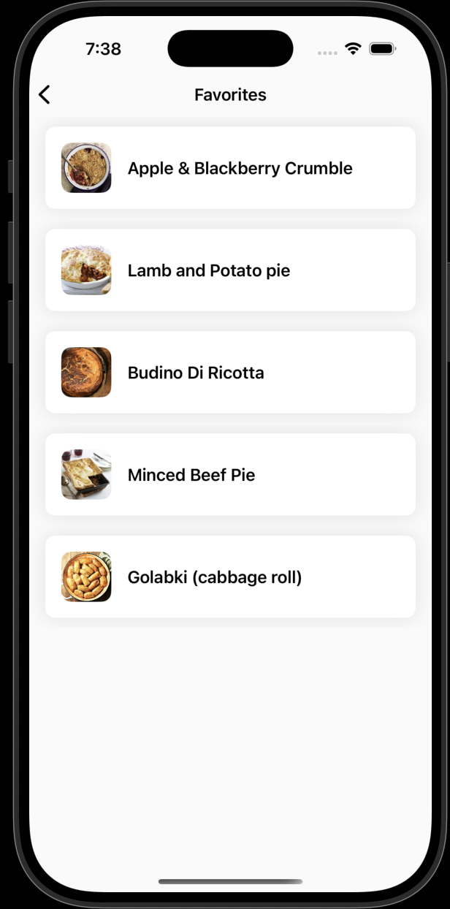

# RecipeBookApp

## Overview
RecipeBookApp is an iOS application designed to help users discover and manage recipes. The app provides a user-friendly interface to browse different categories of dishes, view popular and special recipes, and save favorite dishes for quick access.

## Features
- **Home Screen**: Displays categories, popular dishes, and special dishes using collection views.
- **Dish Listing**: Shows a list of dishes within a selected category.
- **Dish Detail**: Provides detailed information about a dish, including its image, name, description, and calorie count.
- **Favorites**: Allows users to add dishes to their favorites and view them later.
- **Onboarding**: Introduces users to the app with a series of informative slides.

## Screenshots

### Onboarding Experience

*Welcome to RecipeBookApp - Flavours at Your Fingertips*


*Unlock Culinary Excellence - Cook like a pro*


*Savour the Simplicity - Get cooking today*

### Main App Interface

*Home screen featuring food categories, popular dishes, and special dishes*


*List of dishes within a selected category*


*Detailed view of a dish with ingredients, instructions, and nutritional information*


*User's favorite dishes collection*


*Additional app functionality*

## Project Structure
- **AppDelegate.swift**: Sets up the app's main configuration, including UI customization.
- **Info.plist**: Contains app metadata and configuration settings.
- **Models**:
  - `Dish.swift`: Represents a dish with properties like id, name, description, image, and calories.
  - `DishCategory.swift`: Represents a category of dishes.
  - `AllDishes.swift`: Contains collections of categories, popular dishes, and special dishes.
  - `Favorite.swift`: Represents a favorite dish.
  - `OnboardingSlide.swift`: Represents a slide in the onboarding process.
- **Views**:
  - **Home**: Contains the main screen with categories, popular dishes, and special dishes.
  - **ListDishes**: Displays a list of dishes within a selected category.
  - **DishDetail**: Shows detailed information about a dish.
  - **ListFavorites**: Displays the user's favorite dishes.
  - **Onboarding**: Introduces users to the app with informative slides.
- **CustomViews**:
  - **CollectionViewCells**: Custom cells for displaying categories and dishes in collection views.
  - **TableViewCells**: Custom cells for displaying dishes in table views.
  - **CardView**: A custom view for displaying cards with shadow effects.

## Networking
- **NetworkService.swift**: Handles API requests and data fetching, including fetching categories, dishes, and favorites.

## Dependencies
- **Kingfisher**: Used for image loading and caching.
- **ProgressHUD**: Used for displaying loading indicators and success/error messages.

## Getting Started
1. Clone the repository.
2. Open the project in Xcode.
3. Install the required dependencies using CocoaPods:
   ```bash
   pod install
   ```
4. Build and run the app on your iOS device or simulator.

